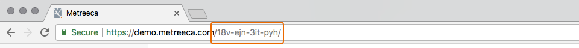

---
title:	    Interacting with Model‑Driven Linked Data REST APIs
excerpt:    Hands-on guided tour of read/write model-driven linked data REST APIs
---

# Getting Started

This example-driven tutorial demonstrates how to interact with read/write REST APIs published with the Metreeca/Link model-driven linked data framework to support rapid data-driven app development. Basic familiarity with  [linked data](https://www.w3.org/standards/semanticweb/data) concepts and [REST](https://en.wikipedia.org/wiki/Representational_state_transfer) APIs is required.

To get started open [https://demo.metreeca.com/workspace/](https://demo.metreeca.com/workspace/) with a [supported](../../handbooks/installation#system-requirements) web browser and activate your demo workspace by agreeing to the terms of service and the privacy policy.

<p class="warning">Demo workspaces are not secured: don't upload personal or otherwise sensitive data.</p>

<p class="warning">Demo workspaces are transient: don't expect edits to outlast browser sessions.</p>

Once your demo workspace is ready, take note of your unique user identifier appearing in the URL displayed in the toolbar of your browser: this will be used later on to build writable resource URLs in your demo workspace.



You may try out the examples in the following sections using your favorite REST testing tool or working from the command line with toos like `curl` or `wget`. If this is the case, save your user identifier to an environment variable.

```sh
% user='***-***-***-***'
```

The demo workspace will be pre-populated with a semantic version of the [BIRT](http://www.eclipse.org/birt/phoenix/db/) sample dataset, cross-linked to [GeoNames](http://www.geonames.org/) entities for cities and countries. The BIRT sample is a typical business database, containing tables such as *offices*, *customers*, *products*, *orders*, *order lines*, … for *Classic Models*, a fictional world-wide retailer of scale toy models.

Before learning how to interact with read/write linked data REST APIs exposing resources and collections from your workspace, you may want to familiarize yourself with the dataset contents following through the [search and analysis tutorial](../search-and-analysis/).

<p class="warning">The demo server is hosted on a cloud service: it is not expected to provide production-level performance and may experience some delays during on-demand workspace initialization.</p>

# Model-Driven APIs

The demo workspace is pre-configured with a small collection of read/write REST APIs  that drive a demo [product catalog](https://demo.metreeca.com/apps/shop/) web interface.

| REST API                                 | Contents                     |
| :--------------------------------------- | :--------------------------- |
| [/product-lines/](https://demo.metreeca.com/product-lines/) | Product line faceted catalog |
| [/product-lines/*](https://demo.metreeca.com/product-lines/classic-cars) | Product line details         |
| [/products/](https://demo.metreeca.com/products/) | Product faceted catalog      |
| [/products/*](https://demo.metreeca.com/products/S18_3140) | Product sheets               |

Usually, even a simple application like this would require extensive back-end development activities in order to connect to the database and perform coordinated custom queries supporting data retrieval, faceted search, facet population, sorting, pagination and so on. User authorization, validation of updates and enforcing of consistency rules would as well require lenghty and error-prone custom back-end development.

Metreeca automates the whole process with a model-driven API engine that compiles high‑level declarative linked data models into read/write REST APIs immediately available for front-end app development, supporting all of the above-mentioned features without back-end coding.

You may learn how to publish your own model-driven linked data APIs following through the [linked data modelling tutorial](../linked-data-publishing/).

# Read Operations

Linked data REST APIs published by Metreeca API engine support controlled read access to  RDF contents managed by the underlying graph storage layer.

User authorization and user-specific content generation are performed according to [role-based](../../references/spec-language.md#parameters) rules integrated in the linked data model driving the API publishing process.

## RDF Resources

RDF resources managed by the underlying graph storage are exposed by the Metreeca REST API engine as [Linked Data Platform (LDP) RDF Sources](https://www.w3.org/TR/ldp/#ldprs).

To retrieve the RDF description of a published resource, as specified by the associated data model, just perform a `GET` operation on the URL identifying the resource.

```sh
% curl "https://demo.metreeca.com/products/S18_3140"

< HTTP/2 200 OK
< Content-Type: text/turtle
```

```text
<https://demo.metreeca.com/products/S18_3140> a <https://demo.metreeca.com/terms#Product> ;
  <http://www.w3.org/2000/01/rdf-schema#label> "1903 Ford Model A" ;
  <http://www.w3.org/2000/01/rdf-schema#comment> "Features opening trunk,  working steering system" ;
  <https://demo.metreeca.com/terms#code> "S18_3140" ;
  <https://demo.metreeca.com/terms#line> <https://demo.metreeca.com/product-lines/vintage-cars> .

<https://demo.metreeca.com/product-lines/vintage-cars> <http://www.w3.org/2000/01/rdf-schema#label> "Vintage Cars" .

<https://demo.metreeca.com/products/S18_3140> <https://demo.metreeca.com/terms#scale> "1:18" ;
  <https://demo.metreeca.com/terms#vendor> "Unimax Art Galleries" ;
  <https://demo.metreeca.com/terms#buy> "68.3"^^<http://www.w3.org/2001/XMLSchema#decimal> ;
  <https://demo.metreeca.com/terms#sell> "136.59"^^<http://www.w3.org/2001/XMLSchema#decimal> ;
  <https://demo.metreeca.com/terms#stock> "3913"^^<http://www.w3.org/2001/XMLSchema#integer> .
```

Standard content negotiation is supported, so you may ask for resource descriptions in a suitable RDF concrete syntax ([Turtle](https://www.w3.org/TR/turtle/), [N-Triples](https://www.w3.org/TR/n-triples/), [RDF/XML](https://www.w3.org/TR/rdf-syntax-grammar/), …) specifying the associated MIME type in the `Accept` HTTP request header.

```sh
% curl --header 'Accept: application/rdf+xml' \
    "https://demo.metreeca.com/products/S18_3140"
    
< HTTP/2 200 OK
< Content-Type: application/rdf+xml
```

```xml
<?xml version="1.0" encoding="UTF-8"?>
<rdf:RDF xmlns:rdf="http://www.w3.org/1999/02/22-rdf-syntax-ns#">

  <rdf:Description rdf:about="https://demo.metreeca.com/products/S18_3140">
    <rdf:type rdf:resource="https://demo.metreeca.com/terms#Product"/>
    <label xmlns="http://www.w3.org/2000/01/rdf-schema#" rdf:datatype="http://www.w3.org/2001/XMLSchema#string">1903 Ford Model A</label>
    <comment xmlns="http://www.w3.org/2000/01/rdf-schema#" rdf:datatype="http://www.w3.org/2001/XMLSchema#string">Features opening trunk,  working steering system</comment>
    <code xmlns="https://demo.metreeca.com/terms#" rdf:datatype="http://www.w3.org/2001/XMLSchema#string">S18_3140</code>
    <line xmlns="https://demo.metreeca.com/terms#" rdf:resource="https://demo.metreeca.com/product-lines/vintage-cars"/>
  </rdf:Description>
  
  ...

</rdf:RDF>
```

JSON-based formats are especially convenient for front-end development: beside the standardised  [JSON-LD](https://www.w3.org/TR/json-ld/) RDF serialisation, Metreeca supports a simpler [idiomatic JSON](../../references/idiomatic-json.md)-based format, which streamlines resource descriptions taking into account the constraints described in the associated linked data models.

To ask for resource descriptions in the idiomatic JSON format, specify the `application/json` MIME type in the `Accept` HTTP request header.

```sh
% curl --header 'Accept: application/json' \
    "https://demo.metreeca.com/products/S18_3140"
    
< HTTP/2 200 OK
< Content-Type: application/json
< Link: <https://demo.metreeca.com/products/S18_3140?specs>; rel="http://www.w3.org/ns/ldp#constrainedBy"
```

```json
{
    "this": "https://demo.metreeca.com/products/S18_3140",
    "type": {
        "this": "https://demo.metreeca.com/terms#Product"
    },
    "label": "1903 Ford Model A",
    "comment": "Features opening trunk,  working steering system",
    "code": "S18_3140",
    "line": {
        "this": "https://demo.metreeca.com/product-lines/vintage-cars",
        "label": "Vintage Cars"
    },
    "scale": "1:18",
    "vendor": "Unimax Art Galleries",
    "buy": 68.3,
    "price": 136.59,
    "stock": 3913
}
```

If available, the linked data model associated with a resource can be retrieved and inspected from the URL provided in the `Link rel="ldp:constrainedBy"`HTTP response header. The information provided by the associated model could be used, for instance, to optimize or dynamically build user interfaces or to automaticaly provide client-side validation on data forms, like done in the default [linked data navigator](https://demo.metreeca.com/products/) of the platform.

<p class="note">The linked data navigator is still a work in progress: more to come as dynamic editing forms are improved and advanced <a href="../search-and-analysis/">search and analysis</a> features like faceted filtering and infographics are integrated in the tool.</p>

## RDF Collections

RDF resource collections managed by the underlying graph storage are exposed by the Metreeca REST API engine as [Linked Data Platform (LDP) Containers](https://www.w3.org/TR/ldp/#ldpc).

To retrieve the RDF description of a published collections, as specified by the associated data model, perform a `GET` operation on the URL identifying the collection.

```sh
% curl --header 'Accept: application/json' \
    "https://demo.metreeca.com/products/"
    
< HTTP/2 200 OK
< Content-Type: application/json
```

```json
{
    "this": "https://demo.metreeca.com/products/",
    "label": "Products",
    "contains": [
        {
            "this": "https://demo.metreeca.com/products/S10_1678",
            "type": {
                "this": "https://demo.metreeca.com/terms#Product"
            },
            "label": "1969 Harley Davidson Ultimate Chopper",
            "comment": "This replica features working kickstand, front suspension, gear-shift lever, footbrake lever, drive chain, wheels and steering. All parts are particularly delicate due to their precise scale and require special care and attention.",
            "code": "S10_1678",
            "line": {
                "this": "https://demo.metreeca.com/product-lines/motorcycles",
                "label": "Motorcycles"
            },
            "scale": "1:10",
            "vendor": "Min Lin Diecast",
            "buy": 48.81,
            "price": 95.7,
            "stock": 7933
        },
      
      ...
      
      ]
 }
```

By default, collection descriptions include a digest description of each collection item, but a concise description of the collection itself may be retrieved using the standard LDP `Prefer` HTTP request header.

```sh
% curl --header 'Accept: application/json' \
    --header 'Prefer: return=representation; include="http://www.w3.org/ns/ldp#PreferMinimalContainer"' \
    "https://demo.metreeca.com/products/"
    
< HTTP/2 200 OK
< Content-Type: application/json
< Link: <https://demo.metreeca.com/products/?specs>; rel="http://www.w3.org/ns/ldp#constrainedBy"
```

```json
{
    "this": "https://demo.metreeca.com/products/",
    "label": "Products"
}
```

Again, if available, the linked data model associated with a collection can be retrieved and inspected from the URL provided in the `Link rel="ldp:constrainedBy"`HTTP response header.

# Write Operations

Linked data REST APIs published by Metreeca API engine support controlled write access to  RDF contents managed by the underlying graph storage layer.

User authorization and user-specific content validation are performed according to [role-based](../../references/spec-language.md#parameters) rules integrated in the linked data model driving the API publishing process.

## Creating Resources

New RDF resources are create by submitting an RDF description to the REST API of a writable RDF collection using the `POST` HTTP method.

Standard content negotiation is supported, so you may submit resource descriptions in a suitable RDF concrete syntax ([Turtle](https://www.w3.org/TR/turtle/), [N-Triples](https://www.w3.org/TR/n-triples/), [RDF/XML](https://www.w3.org/TR/rdf-syntax-grammar/), …) specifying the associated MIME type in the `Content-Type` HTTP request header.

Note that property values that may be inferred from the associated linked data model, like `rdf:type`, may be safely omitted.

```sh
% curl --dump-header - --request POST \
    --header 'Content-Type: text/turtle' \
    "https://demo.metreeca.com/${user}/products/" \
    --data @- <<EOF
    
@prefix demo: <https://demo.metreeca.com/${user}/terms#>.
@prefix rdfs: <http://www.w3.org/2000/01/rdf-schema#>.

<>
    rdfs:label "Piaggio Vespa";
    rdfs:comment "The iconic Piaggio's scooter…";
    demo:scale "1:10";
    demo:vendor "Autoart Studio Design";
    demo:buy 101.0;
    demo:sell 123.0;
    demo:line <https://demo.metreeca.com/${user}/product-lines/motorcycles>.
EOF

< HTTP/2 201 Created
< Location: https://demo.metreeca.com/${user}/products/65
```

The newly created resource is immediately available for retrieval at the URL returned in the `Location` HTTP response header.

The idiomatic model-driven JSON format is supported also for write operations, specifying the `application/json` MIME type in the `Content-Type` HTTP request header.

Note that the `line` property is included in a shorthand form, as it is inferred to be a resource IRI from the associated linked data model.

```sh
% curl --dump-header - --request POST \
    --header 'Content-Type: application/json' \
    "https://demo.metreeca.com/${user}/products/" \
    --data @- <<EOF
{
    "label": "Piaggio Ciao",
    "comment" : "The sturdy Piaggio's velo bike…",
    "scale": "1:10",
    "vendor": "Autoart Studio Design",
    "buy": 87.0,
    "price": 99.0,
    "line": "https://demo.metreeca.com/${user}/product-lines/motorcycles" 
}
EOF

< HTTP/2 201 Created
< Location: https://demo.metreeca.com/${user}/products/21
```

Submitted data is automatically validated agaist the constraints specified in the linked data model driving the target REST API. Submiting, for instance, out of range price data would return an error and a structured error report.

```sh
% curl --dump-header - --request POST \
    --header 'Content-Type: text/turtle' \
    "https://demo.metreeca.com/${user}/products/" \
    --data @- <<EOF
    
@prefix demo: <https://demo.metreeca.com/${user}/terms#>.
@prefix rdfs: <http://www.w3.org/2000/01/rdf-schema#>.

<>
    rdfs:label "Piaggio Vespa";
    rdfs:comment "The iconic Piaggio's scooter…";
    demo:scale "1:10";
    demo:vendor "Autoart Studio Design";
    demo:buy -101.0;
    demo:sell 9999.0;
    demo:line <https://demo.metreeca.com/${user}/product-lines/motorcycles>.
    
EOF

< HTTP/2 422 Unprocessable Entity

<https://demo.metreeca.com/18v-ejn-3it-pyh/products/68> {

    <https://demo.metreeca.com/18v-ejn-3it-pyh/terms#buy> :

        error : invalid value : -101.0 : minInclusive(0.0)

    <https://demo.metreeca.com/18v-ejn-3it-pyh/terms#sell> :

        error : invalid value : 9999.0 : maxExclusive(1000.0)

}
```

## Updating Resource

Existing writable RDF resources are updated by submitting an RDF description to their REST API using the `PUT` HTTP method.

Standard content negotiation is as usual supported through the `Content-Type` HTTP request header, also for the idiomatic JSON format.

Note that  server-managed properties like `demo:code` and `demo:stock` are omitted, as they are inherited from the existing description.

```sh
% curl --dump-header - --request PUT \
    --header 'Content-Type: application/json' \
    "https://demo.metreeca.com/${user}/products/S18_3140" \
    --data @- <<EOF
{
    "label": "1903 Ford Model A",
    "comment": "Features opening trunk,  working steering system",
    "line": "https://demo.metreeca.com/${user}/product-lines/vintage-cars",
    "scale": "1:18",
    "vendor": "Unimax Art Galleries",
    "buy": 68.3,
    "price": 136.59
}
EOF

< HTTP/2 204 No Content
```

The updated resource is immediately available for retrieval at the existing URL.

As in the case of resource creation, submitted data is automatically validated against the constraints specified in the linked data model driving the target REST API.

## Deleting Resources

Existing writable RDF resources are deleted using the `DELETE` HTTP method on their REST API.

```sh
% curl --dump-header - --request DELETE \
    "https://demo.metreeca.com/${user}/products/S18_3140"

< HTTP/2 204 No Content
```

The deleted resource is immediately no longer available for retrieval at the previous URL.

# Faceted Search

Metreeca/Link REST APIs engine extends [Linked Data Platform (LDP) Containers](https://www.w3.org/TR/ldp/#ldpc) with support for faceted search.

To retrieve a digest description of collection items matching a set of facet filters, perform a `GET` operation on the URL identifying the collection, appending a URL-encoded JSON query object [describing the filters](../../references/faceted-search.md) to be applied.

```json
{	
  "filter": { 
    "price" : { ">=": 100 }, 
    "vendor": "Classic Metal Creations"
  }
}
```

```sh
% curl --header 'Accept: application/json' \
    'https://demo.metreeca.com/products?%7B%22filter%22%3A%7B%22price%22%3A%7B%22%3E%3D%22%3A100%7D%2C%22vendor%22%3A%22Classic%20Metal%20Creations%22%7D%7D'
    
< HTTP/2 200 OK
< Content-Type: application/json
```

```json
{
    "this": "https://demo.metreeca.com/products",
    "contains": [
        {
            "this": "https://demo.metreeca.com/products/S10_1949",
            "type": {
                "this": "https://demo.metreeca.com/terms#Product"
            },
            "label": "1952 Alpine Renault 1300",
            "comment": "Turnable front wheels; steering function; detailed interior; detailed engine; opening hood; opening trunk; opening doors; and detailed chassis.",
            "code": "S10_1949",
            "line": {
                "this": "https://demo.metreeca.com/product-lines/classic-cars",
                "label": "Classic Cars"
            },
            "scale": "1:10",
            "vendor": "Classic Metal Creations",
            "buy": 98.58,
            "price": 214.3,
            "stock": 7305
        },
        
      ...
      
    ]
}
```

Note that RDF container descriptions are omitted from faceted search results.

## Sorting and Pagination

Faceted search results may be sorted and paginated including [sorting criteria](../../references/faceted-search.md#sorting-criteria) and [pagination limits](../../references/faceted-search.md#graph-query) in the JSON query object.

```json
{
  "filter": { 
    "price" : { ">=": 100 }, 
    "vendor": "Classic Metal Creations"
  },
  "order":"-price",
  "offset":0,
  "limit":10
}
```

## Facet Stats and Options

The faceted search engine supports also introspection queries for retrieving [facet stats](../../references/faceted-search.md#stats-query)  and available [facet options](../../references/faceted-search.md#items-query).

To retrieve datatype, count and range stats for a facet, taking into account applied filters, specify the target property path in the faceted search query object.

```json
{
    "stats": "price",    
    "filter": { 
        "vendor": "Classic Metal Creations"
    }
}
```

```sh
% curl --header 'Accept: application/json' \
    'https://demo.metreeca.com/products?%7B%0A%09%22stats%22%3A%20%22price%22%2C%09%0A%20%20%20%20%22filter%22%3A%20%7B%20%0A%20%20%20%20%20%20%20%20%22vendor%22%3A%20%22Classic%20Metal%20Creations%22%0A%20%20%20%20%7D%0A%7D'

< HTTP/2 200 OK
< Content-Type: application/json
```

```json
{
    "this": "https://demo.metreeca.com/products",
    "count": 10,
    "min": 44.8,
    "max": 214.3,
    "stats": [
        {
            "this": "http://www.w3.org/2001/XMLSchema#decimal",
            "count": 10,
            "min": 44.8,
            "max": 214.3
        }
    ]
}
```

To list available item options and counts for a facet, taking into account applied filters, specify the target property path in the faceted search query object.

```json
{
    "items": "line",    
    "filter": { 
        "vendor": "Classic Metal Creations"
    }
}
```

```sh
% curl --header 'Accept: application/json' \
    'https://demo.metreeca.com/products?%7B%0A%09%22items%22%3A%20%22line%22%2C%09%0A%20%20%20%20%22filter%22%3A%20%7B%20%0A%20%20%20%20%20%20%20%20%22vendor%22%3A%20%22Classic%20Metal%20Creations%22%0A%20%20%20%20%7D%0A%7D'

< HTTP/2 200 OK
< Content-Type: application/json
```

```json
{
    "this": "https://demo.metreeca.com/products",
    "items": [
        {
            "count": 6,
            "value": {
                "this": "https://demo.metreeca.com/product-lines/classic-cars",
                "label": "Classic Cars"
            }
        },
        {
            "count": 1,
            "value": {
                "this": "https://demo.metreeca.com/product-lines/planes",
                "label": "Planes"
            }
        },
        
          ...
      
    ]
}
```

