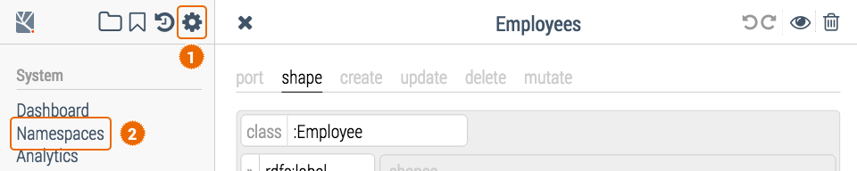
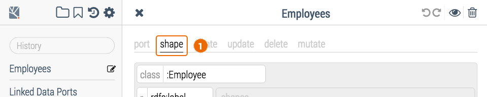
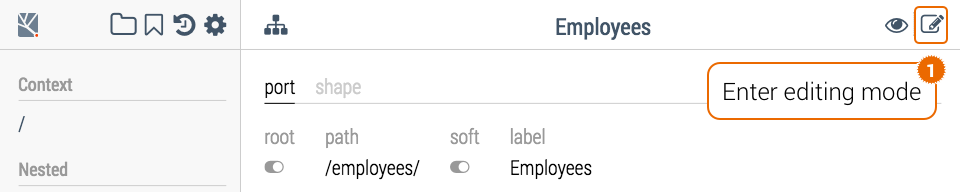

---
title:	    Publishing Model‑Driven Linked Data REST APIs
excerpt:    Hands-on guided tour of linked data modelling and model-driven REST API publishing tools
---

# Getting Started

This example-driven tutorial introduces the building blocks of the Metreeca/Link model-driven linked data framework. Basic familiarity with  [linked data](https://www.w3.org/standards/semanticweb/data) concepts and [REST](https://en.wikipedia.org/wiki/Representational_state_transfer) APIs is required.

To get started open [https://demo.metreeca.com/workspace/](https://demo.metreeca.com/workspace/) with a [supported](../../handbooks/installation#system-requirements) web browser and activate your demo workspace by agreeing to the terms of service and the privacy policy.

<p class="warning">Demo workspaces are not secured: don't upload personal or otherwise sensitive data.</p>

<p class="warning">Demo workspaces are transient: don't expect edits to outlast browser sessions.</p>

The demo workspace will be pre-populated with a semantic version of the [BIRT](http://www.eclipse.org/birt/phoenix/db/) sample dataset, cross-linked to [GeoNames](http://www.geonames.org/) entities for cities and countries. The BIRT sample is a typical business database, containing tables such as *offices*, *customers*, *products*, *orders*, *order lines*, … for *Classic Models*, a fictional world-wide retailer of scale toy models.

Before learning how to expose selected resources and collections from your workspace as  read/write linked data REST APIs, you may want to familiarize yourself with the dataset contents following through the [search and analysis tutorial](../search-and-analysis/).

<p class="warning">The demo server is hosted on a cloud service: it is not expected to provide production-level performance and may experience some delays during on-demand workspace initialization.</p>

<p class="warning">The modelling user interface is still under active development and it is routinely tested only with Chrome: other browsers may exhibit inconstistent layouts and visual glitches.</p>

# Managing Ports

Once your demo workspace is ready, open the linked data port catalog.


The system will open a navigable catalog listing the active linked data ports.


Each *linked data port* specifies how linked data resources whose URLs match a server-relative path pattern will be handled by the linked data server. For instance, the linked data port mapped to `/product-lines/*` specifies  how to handle all of the following linked data resources:

```
https://demo.metreeca.com/product-lines/classic-cars
https://demo.metreeca.com/product-lines/motorcycles
https://demo.metreeca.com/product-lines/planes
…
```

The demo workspace is pre-configured with a number of ports, some exposing default system-managed services (root handler, SPARQL endpoints, …), some defined as Java custom services (`/products-lines/`, /`product-lines/*`, …) supporting the [linked data development tutorial](../linked-data-interaction/).

Ports handling navigation entry points are flagged as *root*; user-defined ports will be flagged as *soft*. Configuration details for each port may be inspected by clicking on the port path.

In the following sections you will learn how to create and manage additional custom  model-driven ports using the interactive linked data modelling tools. We will walk through the process focusing on the task of exposing the [Employee](https://demo.metreeca.com/apps/self/#endpoint=https://demo.metreeca.com/sparql&collection=https://demo.metreeca.com/terms#Employee) directory as a [Linked Data Platform](https://www.w3.org/TR/ldp-primer/) (LDP) Basic Container and a collection of associated RDF resources.

# Creating New Ports


## Editing Port Metadata


<!-- keep aligned with system APIs specs -->

The *port* tab of the port editor supports editing port path patterns and other system metadata.

- **root** / root resource flag

  If selected, flags the resource handled by the port as a navigation entry-point, to be included, for instance, as a root resource in the system [VoID](https://www.w3.org/TR/void/) report

- **path** / the server-relative path pattern

  Must be a syntactically correct [URI absolute path](https://tools.ietf.org/html/rfc3986#section-3.3), optionally followed by a question mark (`?`), a slash (`/`) or a wildcard (`/*`)

- **label** / a human-readable label
- **notes** / an optional human-readable description

The optional trailing character in the path pattern controls how resources are handled by the matching port according to the following schema.

| path pattern | handling mode                            |
| ------------ | ---------------------------------------- |
| `<path>`     | the resource at `<path>` will be handled as an LDP RDF Resource, exposing RDF properties as specified by the port shape (more on that in the next steps…) |
| *`<path>?`*  | the resource at `<path>` will be handled as an LDP Basic Container including all of the RDF resources matched by the port shape |
| *`<path>/`*  | the resource at `<path>/` will be handled as an LDP Basic Container including all of the RDF resources matched by the port shape; an ancillary port mapped to the `<path>/*` pattern is automatically generated to handle container items as LDP RDF Resources, exposing RDF properties as specified by the port shape |
| `<path>/*`   | every resource with an IRI starting with `<path>/` will be handled as an LDP RDF Resource, exposing RDF properties as specified by the port shape |

All resources handled as LDP Basic Container support [faceted search](../../references/faceted-search.md), sorting and pagination out of the box.

## Editing Port Models


The *shape* tab of the port editor supports editing the linked data model associated with the port.

Linked data models are defined with a [SHACL](https://www.w3.org/TR/shacl/)-based [specification language](../../references/spec-language.md), assembling building blocks on an interactive drag-and-drop canvas.

<p class="note">Direct import of of SHACL specs is planned.</p>

Let's start defining a barebone port model stating that all resources of class `:Employee` are to be included as container items, exposing only the `rdfs:label` property for each item.


The relevant [building blocks](../../references/spec-language.md#shapes) are selected from the side palette and dragged to the model canvas. Blocks may be rearranged by dragging them around on the canvas or removed by dragging them out of the canvas.

Resource IRIs may be entered as:

- an absolute IRI (e.g. `https://demo.metreeca.com/product-lines/`);
- a server-relative IRI (e.g. `/product-lines/`);
- a qualified name (e.g. `demo:Office`).

RDF values required by other constraint blocks are entered using Turtle syntax for [IRIs](https://www.w3.org/TR/turtle/#sec-iri) and [literals](https://www.w3.org/TR/turtle/#literals). In this context, absolute and server-relative IRIs must by wrapped inside angle brackets (e.g. `</product-lines/>`). Multiple values are entered as comma-separated Turtle [object lists](https://www.w3.org/TR/turtle/#object-lists).

Available prefixes for qualified names may be inspected and edited from the *Namespaces* catalog under the system configuration toolbox; well-known prefixes like `rdf`, `rdfs`, `xds`, … are made available by default even if not listed in the namespace catalog.



To navigate back to the model editor, hit the browser *back* button or select it from the history sidebar.


To restore the modelling palette, click on the *shape* tab of the port editor.



## Inspecting Handled Resources 

As soon as the new port is created, the system activates the required resource handlers and starts exposing read/write linked data REST APIs at the matching HTTP/S URLs, as specified by the port model.

Exposed containers and resources are immediately available for rapid [linked data development](../linked-data-interaction/) and may be interactively inspected in the linked data navigaton interface.


The linked data navigation interface is dynamically built on the basis of the resource model and supports interactive inspection, editing and cross-linking of linked data resources, validating updates against constraints specified in the resource model.

<p class="note">The linked data navigator is still a work in progress: more to come as dynamic editing forms are improved and advanced <a href="../search-and-analysis/">search and analysis</a> features like faceted filtering and infographics are integrated in the tool.</p>

# Updating Ports

We'll now refine the initial barebone model, exposing more employee properties, like the internal code, forename and surname, and detailing properties roles and constraints.


The extended model makes use of *occurence* and *value* constraints to state that `rdfs:label`, `:code`, `:forename` and `:surname` values are expected:

- to occur exactly once for each resource;
- to be RDF literals of `xsd:string` datatype;
- to possibly match a specific regular expression pattern.

## Parameterizing Models

The `verify` and `server` blocks in the extended model also introduce the central concept of *[parametric](../../references/spec-language.md#parameters)* model.

The `verify` block states that nested constraints are to be used only for validating incoming data and not for selecting existing resources to be exposed as container items. Constraints like the `class`, defined outside the `verify` block, will be used both for selecting relevant resources and validating incoming data.

The `server` block states that nested properties are server-managed and will be considered only when retrieving or deleting resources, but won't be accepted as valid content on resource creation and updating.

In the most general form, models may be parameterized on for different [axes](../../references/spec-language.md#parameters), using the wrapping building blocks available under the *Conditions* tabs of the modelling palette. Building blocks specified outside parametric sectios are unconditionally enabled.

## Controlling Resource Access

Parametric models support the definition of fine-grained access control rules and role-dependent read/write resource views.

<p class="warning">Work in progress…</p>

## Cross-Linking Resources

We'll now extend the employee directory model, adding cross-links to employee supervisors and subordinates.




The `relate` blocks state that `rdfs:label`s for linked employees are to be retrieved along with employee properties, e.g. to drive visualisation, but they are to be disallowed or ignored on resource creation, updating and deletion.

The `shapes` block organizes nested blocks into a visualization box, as demonstrated in the final navigable employee directory.


## Post-Processing Updates

We'll now complete the employee directory model, adding post-processing scripts for updating server-managed properties after entries are created or modified.


The *mutate* SPARQL Update post-processing script will update the server-managed `rdfs:label` property according to user-supplied `:forename`/`:surname` properties after an entry resource managed by the employee directory is created or modified.

```sparql
prefix : <terms#>
prefix rdfs: <http://www.w3.org/2000/01/rdf-schema#>

delete { ?this rdfs:label ?label_ }
insert { ?this rdfs:label ?label }
where {
    ?this rdfs:label ?label_.
    optional {?this :forename ?forename; :surname ?surname }
    bind (concat(?forename, " ", ?surname) as ?label)
}
```

SPARQL Update post-processing scripts are executed after the corresponding state-mutating HTTP method is successfully applied to the target resource, with the following bindings:

| variable | value                                    |
| -------- | ---------------------------------------- |
| `<base>` | the server base URL of the HTTP request  |
| `?this`  | the IRI of the targe resource either as derived from the HTTP request or as defined by the `Location` HTTP header after a POST request |

| script | HTTP method                              |
| ------ | ---------------------------------------- |
| create | POST                                     |
| update | PUT                                      |
| delete | DELETE                                   |
| mutate | POST/PUT/DELETE (all state-mutating methods) |

# Deleting Ports


