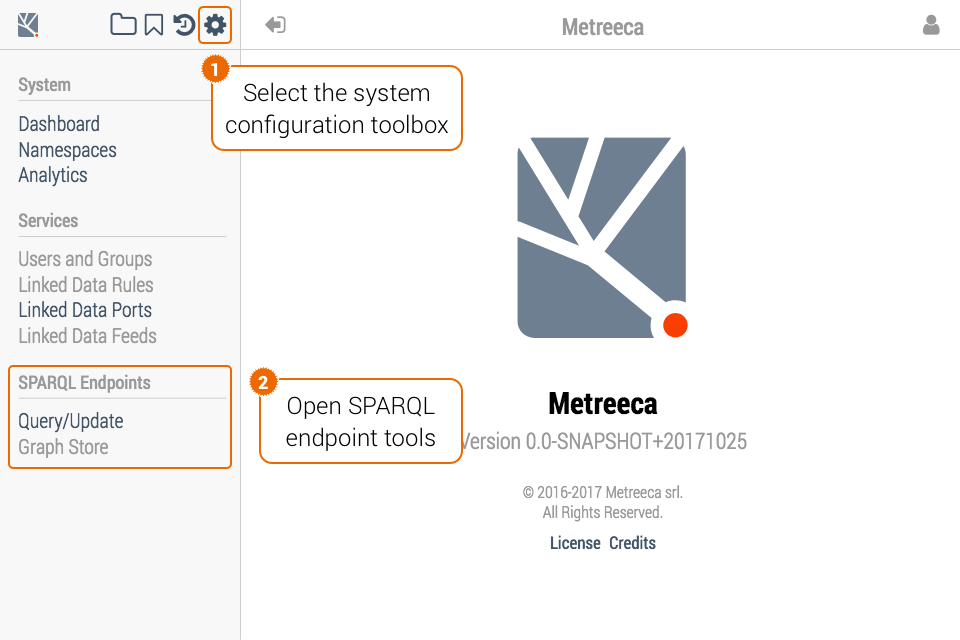

# Bulk Data Management

## SPARQL Endpoints

Bulk data upload, retrieval and management is supported through standard SPARQL 1.1 Update / Graph Store [endpoints](../configuration#sparql-endpoints).

<p class="note">Update operations on all endpoints are always restricted to system administrators; retrieval operations are restricted to system administrators unless otherwise configured.</p>

SPARQL endpoints may be accessed either programmatically on their HTTP ports or interactively from the system configuration toolbox. 

<p class="warning">Work in progress…</p>



## RDF Spooler

Bulk data upload is also supported through an automated RDF [spooler](../configuration#rdf-spooler). To upload RDF files to the graph backend, copy them to the spooling folder defined using the `spool.storage` configuration property and wait for the spooler process to pick it up:

```sh
cp <rdf-file> <{spool.storage}>
```

The spooler accepts both plain RDF files and zip/tar archives containing RDF files, gracefully handling gzip/bzip2 compression.

After files are successfully uploaded, they are automatically removed from the spooling folder. On processing errors,  offending files are marked as ignored and preserved for post-mortem analysis.

<p class="warning">When launching a new server wait for the spooling folder to be created during process initialization before attempting a bulk upload. Be also aware that the spooler process may require some seconds before picking up new files.</p>
